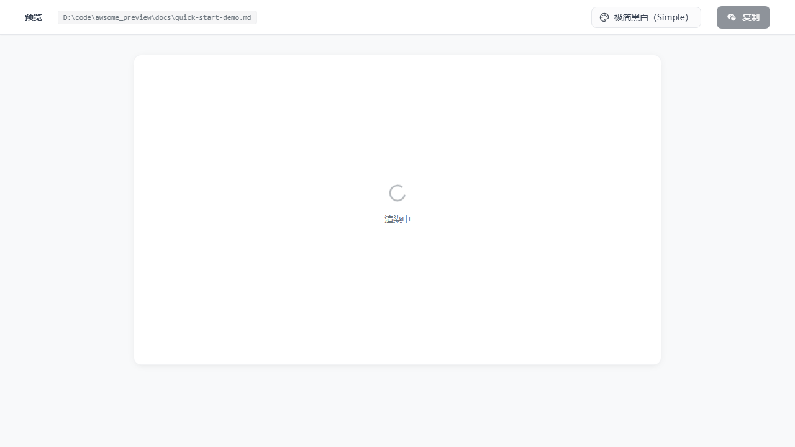
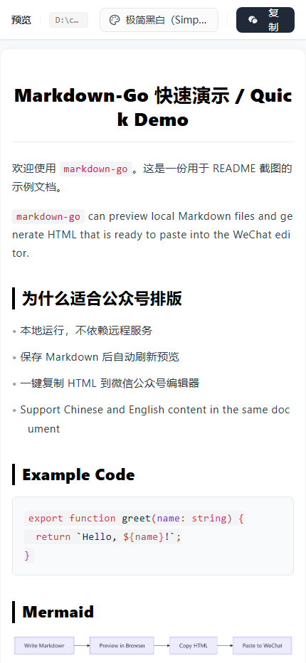

# markdown-go

[English README](./README.en.md)

`markdown-go` 是一个本地运行的 Markdown 预览与发布工作流 CLI，重点优化了微信公众号排版粘贴场景。

## 30 秒快速开始

前置要求：

- Node.js 18+
- npm 9+

安装：

```bash
npm install -g @zacktian/markdown-go
```

运行：

```bash
markdown-go README.md
```

如果你只是想马上试一下，也可以直接预览字符串：

```bash
markdown-go "# Hello markdown-go\n\n你好，世界。" --is-string
```

启动后会发生这些事：

1. 在本地启动一个预览服务。
2. 自动打开浏览器预览页面。
3. 你可以切换排版主题，并将结果一键复制到微信公众号编辑器。

## 它适合做什么

- 预览本地 Markdown 文件，并在保存后自动刷新
- 将 Markdown 渲染成适合微信公众号编辑器粘贴的 HTML
- 支持代码块、Mermaid、任务列表和图片转 Base64
- 内置多套主题，可在预览页切换
- 全程本地运行，不依赖远程服务

## 界面截图

| 桌面端预览 | 窄屏预览 |
| --- | --- |
|  |  |

上面的截图使用仓库中的中英混排示例文档生成，真实反映当前 CLI 启动后的预览界面。

## 三步上手

### 1. 准备一个 Markdown 文件

任意 `.md` 文件都可以，例如：

```md
# 你好 / Hello

这是中文段落。

This is an English paragraph.

- 支持中文
- Supports English
```

### 2. 启动预览

```bash
markdown-go ./your-article.md
```

你会看到本地预览页，并且文件保存后会自动刷新。

### 3. 切换主题并复制

在浏览器里：

- 点击右上角主题按钮切换样式
- 点击“复制”按钮
- 直接粘贴到微信公众号编辑器

## 中文 / English 支持

- 支持中文、英文以及中英混排 Markdown 内容
- 中文标题、英文段落、代码块、Mermaid 图表都可以正常渲染
- 当前预览界面文案以中文为主，但内容渲染本身对中英文都友好

## 常用命令

预览本地文件：

```bash
markdown-go ./example.md
```

直接预览 Markdown 字符串：

```bash
markdown-go "# Hello\n\nThis is a preview." --is-string
```

安装打包好的技能到 AI 编码工具：

```bash
markdown-go install-skill
```

常见变体：

```bash
markdown-go install-skill --tool codex
markdown-go install-skill --tool all
markdown-go install-skill --tool cursor --force
markdown-go install-skill --tool codex --dry-run
```

## 本地开发

安装依赖并构建：

```bash
npm install
```

常用检查命令：

```bash
npm run typecheck
npm run verify:install
npm run verify:skill-install
```

打包 CLI：

```bash
npm run pack:cli
```

## 仓库说明

- 这是一个 workspace 仓库，核心 CLI 位于 `packages/markdown-go-cli`
- `npm install` 会自动执行本地构建，安装完成后即可直接验证 CLI

## License

[MIT](./LICENSE)
