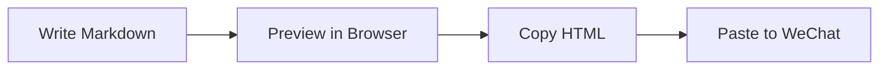

# Markdown-Go 快速演示 / Quick Demo

欢迎使用 `markdown-go`。这是一份用于 README 截图的示例文档。

`markdown-go` can preview local Markdown files and generate HTML that is ready to paste into the WeChat editor.

## 为什么适合公众号排版

- 本地运行，不依赖远程服务
- 保存 Markdown 后自动刷新预览
- 一键复制 HTML 到微信公众号编辑器
- Support Chinese and English content in the same document

## Example Code

```ts
export function greet(name: string) {
  return `Hello, ${name}!`;
}
```

## Mermaid



## Checklist

- [x] Live preview
- [x] Theme switching
- [x] Copy for WeChat
